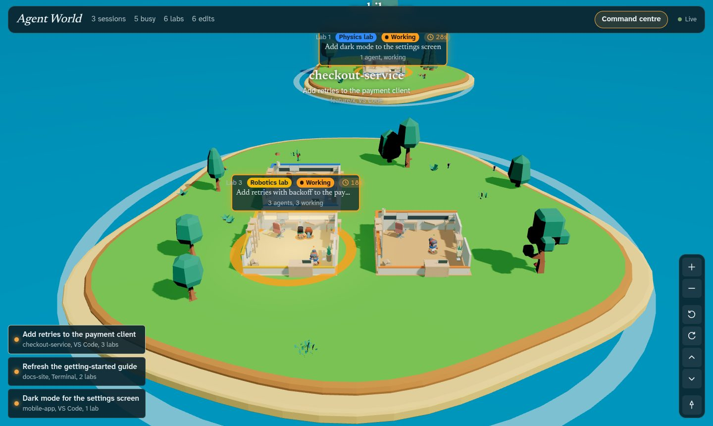
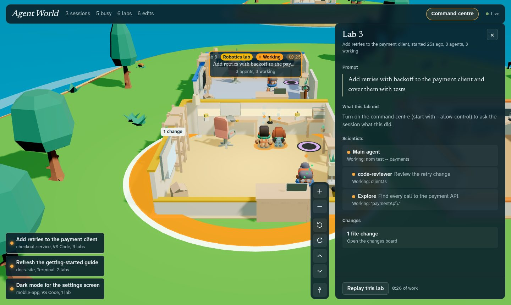

# Agent World

**A live 3D world of every Claude Code agent working on your machine. Watching it costs zero tokens.**



Agent World turns your running Claude Code sessions into a place you can look at:

| In Claude Code | In Agent World |
|---|---|
| All of Claude Code on this machine | The world |
| A running session (VS Code, terminal, desktop, SDK) | A continent (island) |
| A prompt you sent | A lab on that continent |
| The main agent and every subagent it spawns (Explore, Plan, reviewers…) | Scientists working in the lab |

Agent World never calls a model. It only reads the transcript files Claude Code already writes under `~/.claude`, and it never writes to them. Nothing leaves your machine.

## What you can see

- **Who is doing what, live.** Scientists walk to the station that matches their current tool: the workbench to edit, the microscope to read or search, the terminal to run commands, the library for web and MCP calls, the portal to spawn other agents, and the help desk to ask you a question.
- **Which labs are busy.** A lab is lit, with a glowing ring, while anyone inside is working. Each lab shows its prompt, a clock, and how many agents are working. Labs come in five styles (chemistry, biology, physics, computer, robotics), and bigger tasks get bigger labs and islands.
- **Model and effort at a glance.** Body build follows the model (Fable, then Opus, Sonnet and Haiku, from broadest to leanest). The scarf shows the effort level (max red, xhigh violet, high blue, medium teal, low grey). Clothing colour shows the agent's role.
- **What changed.** Every lab has a changes board: click a file to see its diff.
- **What happened.** Replay any lab's work at 1×, 4× or 16×.



## Requirements

- **Node.js 22.12 or newer.** The repo's `.nvmrc` pins Node 24 (LTS), so `nvm use` selects it.
- **Claude Code** running on the same machine.
- **A browser with WebGL**: any recent Chrome, Edge, Firefox or Safari.

Developed and tested on Linux, where the test suite runs on Node 22 and 24. macOS and Windows should work but haven't been tested; see [Platform notes](#platform-notes).

## Quick start

```bash
git clone https://github.com/kalarav-tops/agent-world.git
cd agent-world
nvm use          # Node 24 from .nvmrc
npm ci
npm run build
npm start
```

The terminal prints a link like `http://127.0.0.1:4317/#token=…`. Open that exact link. It carries an access key that changes every time Agent World starts. Reloading the tab keeps working; opening the bare address shows a reminder to use the link.

Leave it running while you work. Sessions appear as you start them and disappear when you close them.

### Install as a command

```bash
npm run build
npm install -g .
agent-world --open      # opens the world in your browser
```

### Options

| Option | Default | What it does |
|---|---|---|
| `--port <n>` | `4317` | Port on `127.0.0.1`; `0` picks a free one |
| `--claude-dir <dir>` | `$CLAUDE_CONFIG_DIR` or `~/.claude` | Which Claude Code config folder to watch |
| `--poll <ms>` | `750` | How often to check for new activity |
| `--open` | off | Open the world in your browser |
| `--allow-control` | off | Turn on the [command centre](#command-centre-optional) |
| `--claude-bin <path>` | found on `PATH` or in `~/.local/bin` | The `claude` executable the command centre uses |
| `--dev-origin <url>` | none | Extra page origin allowed to connect (UI development) |

`agent-world hooks` (or `node dist/server/cli.js hooks`) prints the Claude Code hook settings for answering agents from the world.

## Using the world

| To | Do |
|---|---|
| See what a scientist is doing | Hover it |
| See a scientist's instruction, activity and report | Click it |
| See a lab's prompt, scientists and changes | Click the lab or its name tag |
| See a diff | Open the lab's changes, then a file |
| Watch a lab's work again | **Replay this lab** in the lab panel |
| Fly to a session | Click it in the bottom-left list |
| See everything | Click **Agent World** in the top bar |
| Move the camera | Drag to orbit and scroll to zoom, or use the camera buttons |
| Close the panel | Press Escape |

The camera is on the keyboard too: `+` / `-` zoom, `q` / `e` turn, `w` / `s` tilt, `r` faces north.

Status lamps above each scientist:

| Lamp | Meaning |
|---|---|
| Amber | Working (running a tool) |
| Cyan | Thinking |
| Pink, pulsing | Asking you a question and waiting on you |
| Green | Done |
| Red | Stopped (interrupted) |
| Grey | Idle: no activity for 15 minutes |

The top bar also counts scientists **stuck over 20s**: a tool call pending for more than 20 seconds. That is often a permission prompt waiting for you, and sometimes just a long command; the transcript doesn't say which.

## Command centre (optional)

By default Agent World only watches. Start it with `--allow-control` to act from the world as well:

```bash
npm start -- --allow-control
```

| You can | How it works |
|---|---|
| **Send a prompt** (Command centre, top bar) | Pick a session, then **Continue this session's work** or **Start a new task** in its project folder, choose a permission mode and write the prompt. Continuing runs `claude -p --resume <id> --fork-session`. That is a copy with the whole conversation, so the session open in your editor is never written into. |
| **Ask what a lab or agent did** (side panel) | Runs a throwaway copy of the session with no tools, no MCP servers and nothing saved. You get an explanation, an example, and what it fixed or worked on. |
| **Answer agent questions and permission prompts** | Needs the hook below. When an agent asks a question or needs permission, a card appears at the top of the world, showing exactly what would be allowed: the whole command, path, URL or tool arguments. Answer there, or wait: after 120 seconds the card goes away and the normal dialog appears in the session. |

To answer agents from the world, print the hook settings and merge them into `~/.claude/settings.json`:

```bash
node dist/server/cli.js hooks
```

The hook does nothing unless Agent World is running with `--allow-control`. Otherwise it exits at once and Claude Code behaves as before. If no cards appear, Claude Code may not find `node` on its `PATH`; put the full path to `node` in the hook command.

Good to know:

- Prompts and explanations **use your Claude usage**, just as if you typed them. Watching stays free.
- Slash commands (`/compact`, `/review`, …) and `!` shell commands can't be sent; Claude Code only runs them when typed in the session.
- Prompts can't start with `-`, because the prompt is passed to `claude` as a command-line argument.
- At most 3 runs go at once, each stopped after 30 minutes. Explanations run one per session and two overall. Closing Agent World stops them all, including any commands they started.
- A permission request longer than 8,000 characters can be denied from the world but must be allowed in the session, where you can read all of it.

## Privacy and security

- **Local only.** The server listens on `127.0.0.1` and makes no network requests.
- **Read-only by default.** It never writes under your Claude Code folder, and it never sends input to a session unless you start it with `--allow-control`.
- **Access key.** Every API request and the live connection need a key created at each start. No endpoint hands the key out; it exists only in the link printed in your terminal. The page moves it from the address bar into the tab's session storage.
- **Other websites can't read it.** Requests with a foreign `Host` header are refused (DNS-rebinding guard). WebSocket connections from other origins are refused. No CORS headers are sent.
- **Hook channel.** With `--allow-control`, the hook reads the key from `~/.agent-world/server.json`. Only you can open the folder (mode 700), and the file is removed when Agent World stops.
  - The hook trusts the file only if you own it, nobody else can read it, and the process that wrote it is still running.
  - The hook never sends the key: it signs each request, and it accepts an answer only from a server that proves it holds the key.
  - It sends nothing about the tool call until that proof arrives, so a program that takes over the port learns nothing and can't fake an answer.
- **Stale answers are refused.** An answer counts only while the agent's hook is still waiting for it.
- **No shell.** `claude` is launched with an argument list, in the working folder Claude Code's own session registry reports, never one sent by the browser.
- **Key exposure.** `--open` goes through a private page in `~/.agent-world`, so the key never appears on a command line. The key does end up in your browser history as part of the link; on a shared login, stop Agent World when you're done, which retires the key.
- **Don't expose the port.** Your transcripts contain your code and prompts.

## How it works

```
~/.claude (read-only)
  sessions/<pid>.json                     which sessions are live
  projects/<project>/<session>.jsonl      what the main agent does
  projects/<project>/<session>/subagents  what each subagent does
        │  poll: stat, then read only the newly appended bytes
        ▼
server (Node)    normalise lines → world model → WebSocket to the browser
        ▼
browser (React Three Fiber)    3D world, panels, replay
```

- A session is live while its registry file exists and its process is running.
- Every prompt you type opens a new lab, follow-ups included: telling a follow-up from a new task would need a model.
- Subagents are placed in the lab whose prompt spawned them.

The full design is in [`docs/design.md`](docs/design.md).

The transcript format is internal to Claude Code and can change between versions. Unknown lines are skipped, so a format change shows up as missing detail, not a crash.

## Develop

```bash
npm run dev:server      # API + WebSocket on :4317, reloads on change
npm run dev:web         # Vite on :5173 with hot reload
                        # open http://localhost:5173/#token=<the key dev:server printed>
npm test                # unit + integration tests
npm run test:coverage   # same, with an 80% coverage threshold
npm run typecheck
npm run build && npm run test:e2e   # Playwright against the built server
```

End-to-end tests need Chromium: run `npx playwright install chromium`, or set `PW_CHROMIUM_PATH` to an existing Chromium binary.

| Folder | Holds |
|---|---|
| `src/server` | Session registry, transcript tailer, normaliser, world reducer, engine, HTTP/WebSocket server, command centre, hook, CLI |
| `src/shared` | Types and pure helpers used by both sides (prompt cleaning, tool summaries, diff, replay) |
| `src/web` | The React Three Fiber app: `scene/` for 3D, `ui/` for panels, `state/` for data |
| `src/web/public/models` | 3D models (see [Credits](#credits)) |
| `tests` | `unit`, `integration`, `e2e`, and transcript-line fixtures |
| `docs` | Design notes and README images |

## Platform notes

- **Linux:** fully supported. Liveness checks also compare process start times, so a reused pid is never mistaken for a live session or server.
- **macOS:** should work; untested. Liveness uses the pid alone.
- **Windows:** should work; untested. Stopping a command-centre run stops `claude` itself but not commands it started, because Windows has no process groups.

## Troubleshooting

| Symptom | Fix |
|---|---|
| "UI not built" in the terminal | Run `npm run build` |
| "This page needs its access link" | Open the link Agent World printed in the terminal; it changes at every start |
| The world stopped updating after a restart | That tab has the old key. Open the new link |
| Port already in use | `npm start -- --port 4400` |
| No continents while Claude Code is running | Check `--claude-dir`. If you set `CLAUDE_CONFIG_DIR` for Claude Code, set it here too |
| Blank page or WebGL message | Turn on hardware acceleration in your browser |
| Command centre says `claude` was not found | Pass `--claude-bin /path/to/claude` |

## Credits

- 3D models: [Kenney](https://www.kenney.nl) Mini Characters, Furniture Kit and Nature Kit, all [CC0](https://creativecommons.org/publicdomain/zero/1.0/). Their licence files sit next to the models in `src/web/public/models`.
- Fonts: [Atkinson Hyperlegible Next](https://fontsource.org/fonts/atkinson-hyperlegible-next) and [Newsreader](https://fontsource.org/fonts/newsreader), via Fontsource, under the SIL Open Font License.
- Built on [three.js](https://threejs.org), [React Three Fiber](https://r3f.docs.pmnd.rs) and [drei](https://drei.docs.pmnd.rs).

Agent World is an independent project and isn't affiliated with or endorsed by Anthropic.

## License

[MIT](LICENSE) © 2026 kalarav
